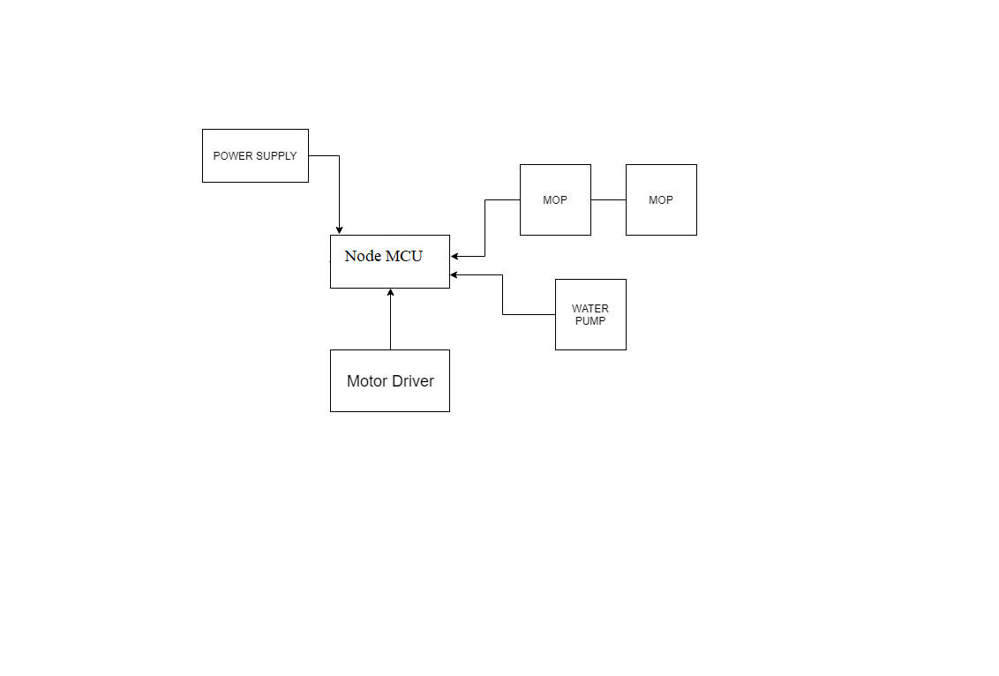
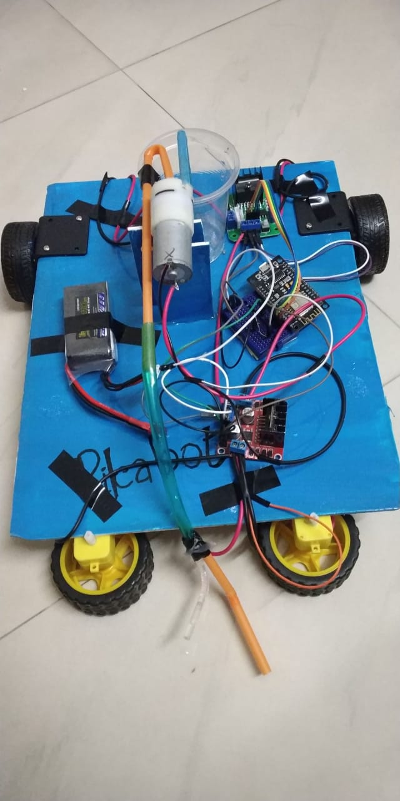
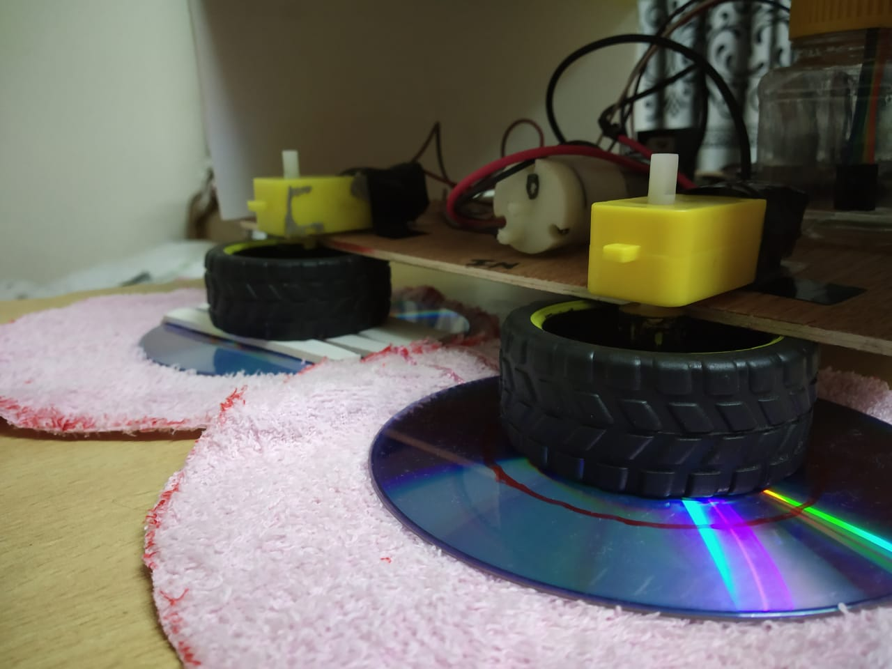

# Mobile-Controlled-Floor-Cleaning-Robot
The project includes a motorized car that sweeps the floor and can be remotely controlled via smart phones over the WiFi. This project is based on NodeMCU, an open-source IoT platform.

## System Architecture

## Prototype Model

## Wheel Arrangement

